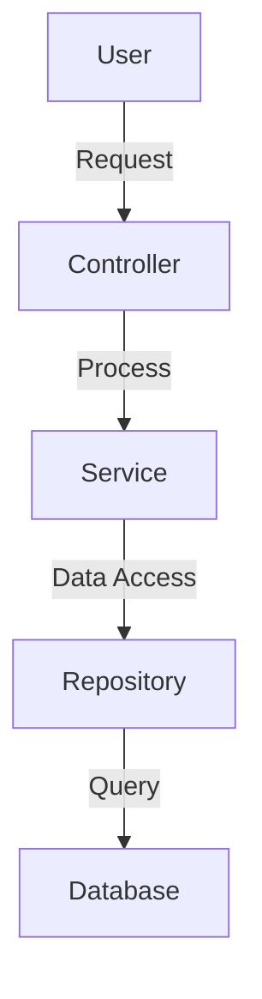
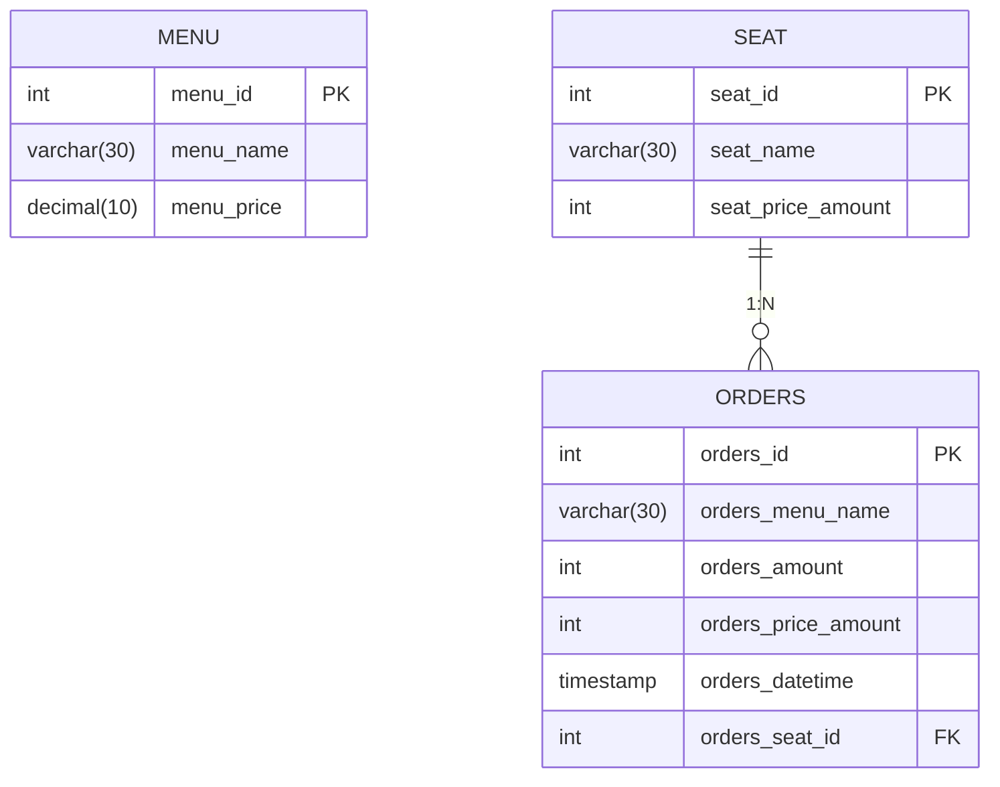

# レストラン注文管理システム
レストランを運営する際にテーブル注文を受けて注文履歴を計算してくれる機能の職員用アプリケーションです。

従業員は自分のスマートフォンで注文を受け、支払い時に総額を計算できます。

# 技術スペック
## back-end framework : Java spring boot
- 使用理由 : 
  1. ウェブプロジェクトに必要な多くの機能を持っている(Tomcat、テストツールなど)
  2. Springのモジュール化された設計構造によりアプリケーションの拡張性が良い
  3. 多くの開発者が使用しているウェブプログラミングツールとして多くのリファレンス資料がある

## front-end : thymeleaf, bootstrap
- 使用理由 :　
  1. 速い画面開発のためにThymeleafとBootstrapを利用

## database : mybatis, mysql
- 使用理由 : 
  1. オープンソース関係型データベースの一つとして多くの開発者が使用する技術であるため、リファレンス資料が豊富。
  2. 小規模のプロジェクトでも十分な性能を保障する。 特にトランザクション処理、インデックス機能を基本に持っているため、安定したデータ管理が可能。

# 機能 & サービス説明
機能は大きくメニュー管理、ホーム管理、席管理に分かれています

## ホーム画面
レストランにメニューを登録するボタンと、テーブルと注文を管理するボタンが存在します。

## メニュー管理
すでに登録されているメニューを見ることができます。
[이미지]

レストランで注文できるメニューを登録します。
[이미지]

## 席管理
テーブルを設定できる画面です。 レストランによってテーブルの数と名前を決めることができます。

テーブルでは、テーブルで注文した価格の合計を表示して計算するときに便利です。

注文が完了したら、初期化ボタンを押して、新しいお客様のための準備をします。
[이미지]

## 注文管理
テーブルごとに注文を等読できます。
[이미지]

数量とメニューを定めることができます。数量の基本値は1です。
[이미지]

注文登録はメニューから登録したメニューをセレクトボックスから選択できます。
[이미지]

注文を追加すると次のようにテーブルに表示されます。
[이미지]

初期化ボタンを押すと、注文に保存した内容が消えます。
[이미지]

# アーキテクチャ説明

## アーキテクチャ
- Controller：リクエストを受け取り、レスポンスを返す
- Service：ビジネスロジックを処理する
- Repository（DAO）：データベースと接続する
- Entity：データモデルを表す

## request流れ

## テーブルERD

