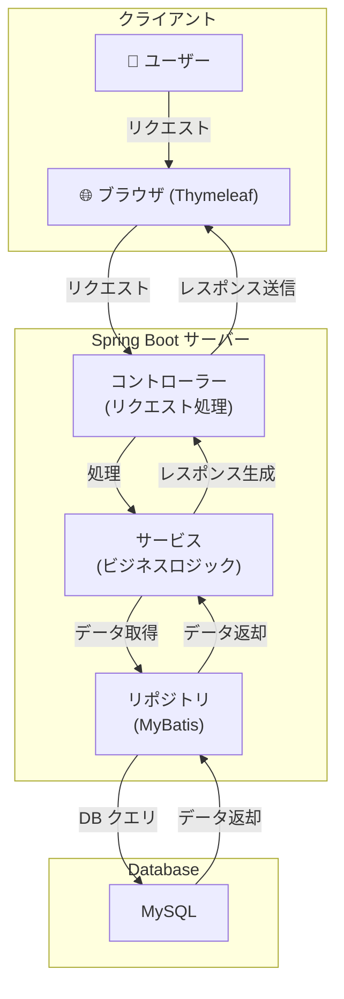
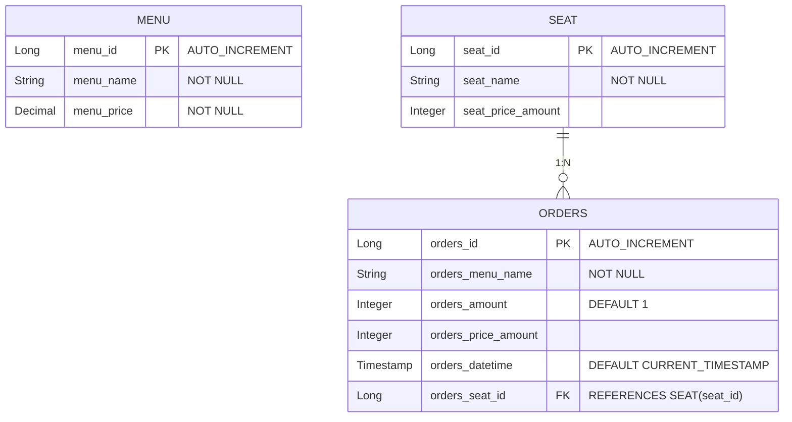

# 🍽️ Restaurant Order System

## 概要
このプロジェクトは、レストランの注文管理を行うためのシステムです。メニュー管理、座席管理、注文管理を行うことができ、Spring Boot を用いて開発されました。

### このアプリの主な機能
- **メニュー管理**: メニューの追加、編集、削除
- **注文管理**: 顧客の注文受付、注文履歴管理
- **座席管理**: レストランの座席予約および管理
- **検索機能（開発予定）**: メニューや注文の検索機能

---

## 技術スタック
| 分類        | 技術                   |
|------------|----------------------|
| **言語**   | Java 17              |
| **フレームワーク** | Spring Boot, Mybatis |
| **テンプレートエンジン** | Thymeleaf            |
| **フロントエンド** | JavaScript           |
| **データベース** | MySQL                |
| **ビルドツール** | Gradle               |

---

## アーキテクチャ


---

## データベース ER 図


---

## セットアップ & 実行方法
### **1️⃣ 環境構築**
- JDK 17 以上をインストール
- MySQL (DB: `restaurant_db`) をセットアップ
- `application.properties` にデータベース情報を設定

### **2️⃣ プロジェクトの実行**
#### **Gradleを使用**
```sh
./gradlew bootRun
```
#### **Mavenを使用**
```sh
mvn spring-boot:run
```

### **3️⃣ アクセス**
- **アプリ URL:** `http://localhost:8080`

---

## 📌 API エンドポイント
| HTTP メソッド | エンドポイント       | 説明 |
|--------------|------------------|------|
| `GET`       | `/menu`          | メニュー一覧取得 |
| `POST`      | `/menu`          | メニュー追加 |
| `GET`       | `/seat`          | 座席一覧取得 |
| `POST`      | `/seat`          | 座席追加 |
| `GET`       | `/orders`        | 注文一覧取得 |
| `POST`      | `/orders`        | 注文作成 |

---

## スクリーンショット


---

## ✨ 今後のアップデート予定
- ✅ **検索機能**: メニューや注文を検索できる機能
- ✅ **予約機能**: 座席の事前予約を可能にする


