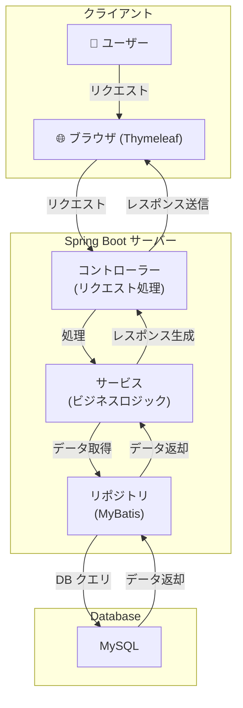
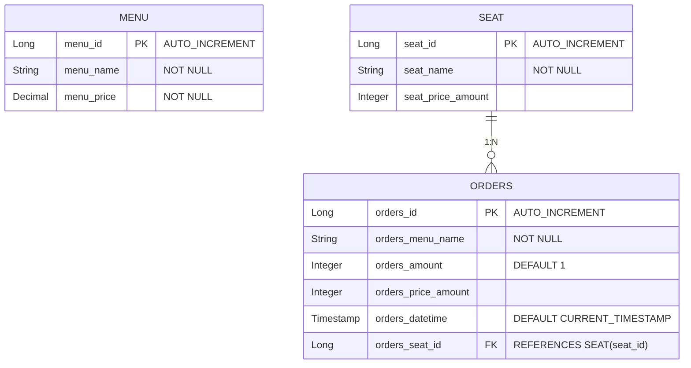

# 🍽️ Restaurant Order System

## 概要
このプロジェクトは、レストランの注文管理を行うためのシステムです。メニュー管理、座席管理、注文管理を行うことができ、Spring Boot を用いて開発されました。

### このアプリの主な機能
- **メニュー管理**: メニューの追加、編集、削除
- **注文管理**: 顧客の注文受付、注文履歴管理
- **座席管理**: レストランの座席予約および管理
- **検索機能（開発予定）**: メニューや注文の検索機能

---

## 技術スタック
| 分類        | 技術                   |
|------------|----------------------|
| **言語**   | Java 17              |
| **フレームワーク** | Spring Boot, Mybatis |
| **テンプレートエンジン** | Thymeleaf            |
| **フロントエンド** | JavaScript           |
| **データベース** | MySQL                |
| **ビルドツール** | Gradle               |

---

## アーキテクチャ

---

## データベース ER 図

---

## セットアップ & 実行方法
### **環境構築**
- JDK 17 以上をインストール
- MySQL (DB: `restaurant_db`) をセットアップ
- `application.yml` にデータベース情報を設定

### **アクセス**
- **アプリ URL:** `http://localhost:8080`

---

## スクリーンショット
### ホーム画面
ホーム画面では、メニューを設定するボタンと、レストランの席ごとの注文を管理する画面を選択できます。

### メニュー設定
メニューを設定、編集、削除する画面です。

メニューは名前と価格を設定します。

### 席の設定
各テーブルごとの注文状況を一目で確認できます。注文の合計金額は、そのテーブルで注文された合計金額です。会計が完了したら、リセットボタンを押してください。

注文を設定する際は、名前のみを設定します。名前はテーブルごとに変更や削除が可能です。

### 注文詳細
注文リストでは、テーブルの顧客の注文を追加できます。

「注文追加」ボタンを押すと、注文可能なメニューがセレクトボックスに表示されます。注文の数量とメニューを選択します。

注文を設定すると、テーブル画面には次のように表示されます。

リセットボタンを押すと、すべての注文が削除されます。

---

## ✨ 今後のアップデート予定
- **検索機能**: メニューや注文を検索できる機能
- **予約機能**: 座席の事前予約を可能にする

