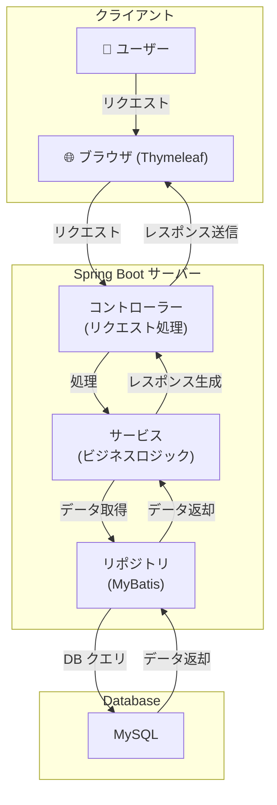
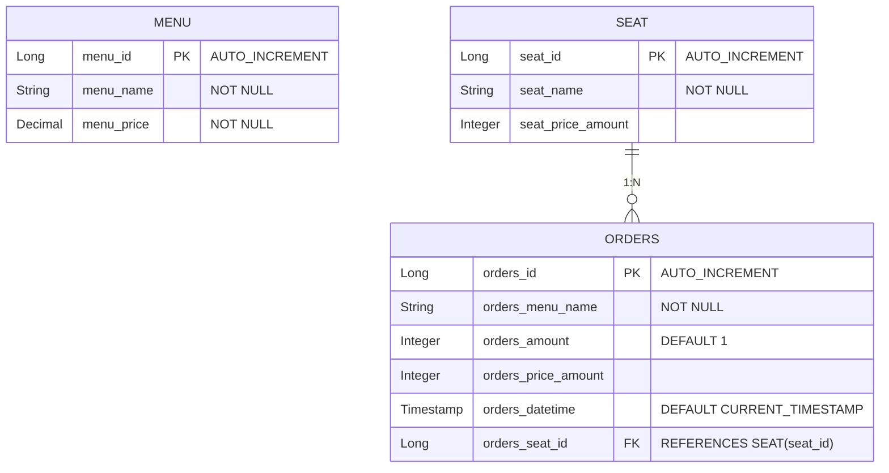

# 🍽️ Restaurant Order System

## 概要
このプロジェクトは、レストランの注文管理を行うためのシステムです。メニュー管理、座席管理、注文管理を行うことができ、Spring Boot を用いて開発されました。

### このアプリの主な機能
- **メニュー管理**: メニューの追加、編集、削除
- **注文管理**: 顧客の注文受付、注文履歴管理
- **座席管理**: レストランの座席予約および管理
- **検索機能（開発予定）**: メニューや注文の検索機能

---

## 技術スタック
| 分類        | 技術                   |
|------------|----------------------|
| **言語**   | Java 17              |
| **フレームワーク** | Spring Boot, Mybatis |
| **テンプレートエンジン** | Thymeleaf            |
| **フロントエンド** | JavaScript           |
| **データベース** | MySQL                |
| **ビルドツール** | Gradle               |

---

## アーキテクチャ

---

## データベース ER 図

---

## セットアップ & 実行方法
### **環境構築**
- JDK 17 以上をインストール
- MySQL (DB: `restaurant_db`) をセットアップ
- `application.yml` にデータベース情報を設定

### **アクセス**
- **アプリ URL:** `http://localhost:8080`

---

## スクリーンショット
### ホーム画面
홈화면에서는 메뉴를 설정하는 버튼과 레스토랑 자리별 주문을 관리하는 화면을 선택할 수 있습니다.
[image]

### メニュー設定
메뉴를 설정하고 수정하고 삭제하는 화면입니다
[image]

메뉴는 이름과 가격을 설정합니다.
[image]

### 席の設定
테이블 마다 주문을 받은 현황을 한눈에 볼 수 있습니다. 주문 총 가격은 해당 테이블에서 주문한 총 가격입니다. 계산을 완료하면 초기화 버튼을 눌러줍니다.
[image]

주문을 설정할 때는 이름만 설정합니다. 이름은 테이블 마다 변경할 수 있고 삭제 할 수 있습니다.
[image]

### 注文詳細
주문 리스트에서는 테이블의 고객의 주문을 추가할 수 있습니다.
[image]

주문 추가를 누르면 주문이 가능한 메뉴가 셀렉트 박스로 나타납니다. 주문 양과 메뉴를 정해줍니다.
[image]

---

## ✨ 今後のアップデート予定
- ✅ **検索機能**: メニューや注文を検索できる機能
- ✅ **予約機能**: 座席の事前予約を可能にする

